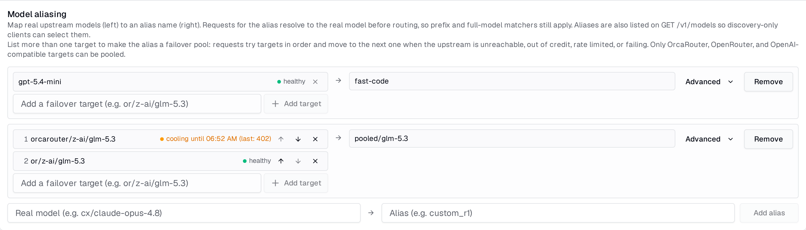

# Alias Pools

A model alias normally maps one client-facing name to one real model. Give it
more than one target and it becomes a **failover pool**: Chat Completions
requests for the alias try the targets in order and move to the next one when
the current upstream is unreachable, out of credit, rate limited, or failing.

The motivating case is a model you buy from more than one place. Cursor is
configured with one name, `pooled/glm-5.3`; when the prepaid router runs dry,
the session keeps working on the next provider without anyone editing client
configuration.

## Setting up a pool

In **Settings -> Advanced -> Routing -> Model aliasing**, each alias row lists
its targets. Add a target with the input under the list, change the order
with the arrows, and remove with the `x` (the last target cannot be removed;
delete the alias instead). Every change is saved immediately.

Targets are the same names you would send as `model` directly: a sidecar's
prefixed id such as `orcarouter/z-ai/glm-5.3` or `or/z-ai/glm-5.3`, or a
full-model match configured on that integration. The order is the priority
order; the first target is the pool's default and is what non-pooled paths
(the Responses API, `GET /v1/models` metadata) use.

A pool is validated when you save:

- targets must be distinct, and an alias cannot be a target of another alias
- every target of a pool with two or more entries must resolve to a
  **pool-capable** integration: OrcaRouter, OpenRouter, or a generic
  OpenAI-compatible endpoint
- native Codex accounts cannot sit in a pool, so a single-target alias pointing
  at a Codex model keeps working exactly as before

Only the aliases you change are checked, so aliases saved before pools existed
keep working, even one that names another alias. You can turn an integration
off while pools still list it: its targets are skipped until you turn it back
on. The same goes for an OrcaRouter or OpenRouter integration that is on but
has no API key: its targets are skipped, and the prompt is never sent to it.
If no target of a pool can be used, the request fails with
`alias_pool_unavailable` (HTTP 503) without contacting any upstream.

A rejected save is shown on the offending row and your edited list stays in
place so you can fix it rather than re-enter it.

## What failover covers

Failover happens **before the first byte** of a response. Once an upstream has
answered `200` and streaming has started, the response is committed to that
target; a stream that breaks halfway is returned as it broke, the same as
without a pool.

A target is skipped and the next one tried when its upstream:

- cannot be reached (connection error, timeout)
- returns `401`, `402`, `403`, `408`, `429`, or a `5xx`

Anything else, `400` and `404` in particular, is returned to the client from
the first target that produced it. Those are request or configuration errors
that would fail on every target, and the Cursor context-length compatibility
path depends on seeing the `400`.

A `5xx` or an unreachable upstream is first sent once more to the **same**
target, as it is without a pool: OrcaRouter and OpenRouter pick the upstream
provider themselves, so a second call often lands on a healthy one. The pool
moves on only if that retry fails too. The other statuses in the list move on
at once. A gateway timeout (`524`, about 5 minutes) can therefore cost a target
two timeouts before the next target is tried.

If every target fails, the client receives the last target's error and an
`X-Codex-LB-Pool-Attempts` header with the number of targets tried. The
same-target retry does not count as an extra attempt.

## Cooldowns and health

A target that fails over is **cooled** for a while so the next request does not
pay for the same failure:

| Failure | Cooldown |
|---|---|
| `402` out of credit | 30 minutes |
| `429` with `Retry-After` | the header value, capped at 1 hour |
| anything else retryable | 60 seconds |

Cooling targets move behind the healthy ones, so a request goes straight to
the next healthy target and only reaches a cooling one if the healthy ones
all fail. If every target is cooling, they are tried soonest-to-expire first.
A successful response clears the target's cooldown.

Each target chip in the editor shows its state: **healthy**, or **cooling until
HH:MM** with the last upstream status. The section refreshes every 15 seconds
while it is open. The same data is available from
`GET /api/settings/alias-pools/health` with dashboard auth.

Cooldowns live in process memory. After a restart every target is healthy
again.

## Reading the request log

A pooled request is logged under the alias as its `model`, with two extra
fields: `upstream_model` names the target that produced the response and
`pool_attempts` is how many targets were tried. Cost comes from the serving
target's provider, so a request that failed over from OrcaRouter to OpenRouter
is priced as an OpenRouter request.

For a per-attempt trail, grep the server log for `alias_pool_attempt` by
request id; each line records the target, the attempt number, and the outcome
(`served`, `failover` with the upstream status, `skipped_cooling`, or
`rejected` with a reason of `access`, `unroutable`, or `not_configured`). A
rejected target was never sent the request, so it does not count toward
`pool_attempts`.

## API keys and quotas

A key's model allowlist applies to the alias and to each target. Requesting an
alias the key may not use is refused before any upstream call. A target the
key may not use is skipped without aborting the pool; if the alias is allowed
but every target is disallowed, the request is refused with
`model_not_allowed` and counts against no usage limit.

Usage limits reserve once, against the alias, before the first attempt. Only
the attempt that answers the client settles that reservation, from its own
usage and cost, and a total failure releases it once.

## Upgrading and rolling back

Upgrading leaves your existing aliases as they are, so replicas still on the
previous version keep reading and saving them during a rolling upgrade. Add
fallback targets only after every replica runs this version: an older replica
cannot see a pool, and its next settings save removes it.

Versions before alias pools store one target per alias. Downgrading the
database past this release keeps every one-target alias, but refuses, changing nothing, while any alias still has fallback targets: the
error names them. Reduce each to the one target it should keep, then run the
downgrade again.

---

*Specs: [alias-pool-routing](https://github.com/Soju06/codex-lb/tree/main/openspec/specs/alias-pool-routing) · [chat-completions-compat](https://github.com/Soju06/codex-lb/tree/main/openspec/specs/chat-completions-compat) · [api-keys](https://github.com/Soju06/codex-lb/tree/main/openspec/specs/api-keys) · [model-catalog-compat](https://github.com/Soju06/codex-lb/tree/main/openspec/specs/model-catalog-compat)*
