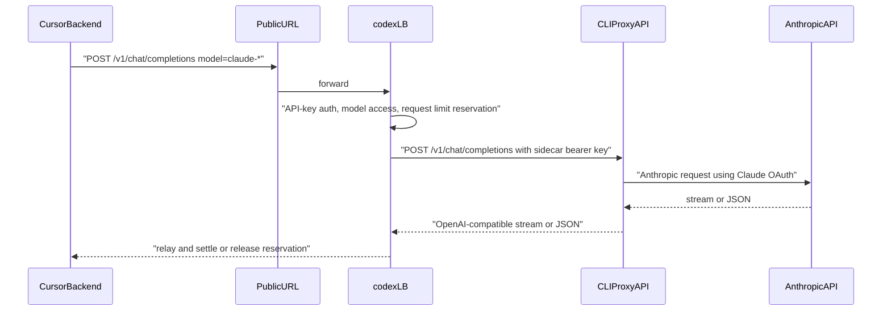

# Claude Sidecar Routing Context

## Purpose and scope

This change lets codex-lb act as the public OpenAI-compatible endpoint for Cursor while delegating Claude subscription traffic to CLIProxyAPI. CLIProxyAPI remains the owner of Claude OAuth, token refresh, Anthropic API calls, OpenAI-to-Anthropic translation, streaming, tools, and vision.

codex-lb only decides whether a request is a Claude sidecar request, forwards it to CLIProxyAPI, and relays the result to the downstream client.

## Architecture decision

CLIProxyAPI runs separately from codex-lb. Operators install it, run `cli-proxy-api --claude-login`, start the CLIProxyAPI service on a local port such as `127.0.0.1:8317`, and configure codex-lb with env vars.

codex-lb dispatches by the effective model name after API-key enforced-model resolution. A model whose lowercased name starts with a configured prefix such as `claude` is a sidecar candidate. The model name is forwarded unchanged so Cursor custom IDs can match CLIProxyAPI's own model catalog.

## Runtime flow



## CLIProxyAPI setup example

Create `~/.cli-proxy-api/config.yaml`:

```yaml
port: 8317
auth-dir: "~/.cli-proxy-api"
api-keys:
  - "<sidecar-api-key>"
debug: false
```

Run Claude OAuth:

```bash
cli-proxy-api --claude-login
```

Start the sidecar:

```bash
cli-proxy-api --config ~/.cli-proxy-api/config.yaml
```

Verify the sidecar before enabling codex-lb routing:

```bash
curl -H "Authorization: Bearer <sidecar-api-key>" http://127.0.0.1:8317/v1/models
```

## codex-lb env example

```bash
CODEX_LB_CLAUDE_SIDECAR_ENABLED=true
CODEX_LB_CLAUDE_SIDECAR_BASE_URL=http://127.0.0.1:8317
CODEX_LB_CLAUDE_SIDECAR_API_KEY=<sidecar-api-key>
CODEX_LB_CLAUDE_SIDECAR_MODEL_PREFIXES='["claude"]'
```

## Cursor setup notes

Cursor's backend calls the configured OpenAI base URL, so `localhost` is not sufficient for real Cursor traffic unless Cursor itself can reach that address. Use a public codex-lb deployment or a tunnel such as Cloudflare Tunnel.

In Cursor settings:

- Set OpenAI Base URL to `https://<public-codex-lb-host>/v1`.
- Set OpenAI API Key to a codex-lb proxy API key.
- Add dated custom model IDs copied from `GET /v1/models`, for example `claude-sonnet-4-5-20250929`.
- Select the custom model, not a built-in Cursor Claude model. Built-in model IDs can bypass custom base URL routing.

Cursor can toggle off the OpenAI API Key setting unexpectedly. If requests begin returning 401 or bypassing codex-lb, re-enable the key setting and reselect the custom model.

## Failure modes

- Sidecar process down or unreachable: codex-lb returns a 503 OpenAI error envelope and releases any API-key reservation.
- CLIProxyAPI OAuth expired: CLIProxyAPI returns its own auth error; codex-lb relays an OpenAI-compatible error when available. Re-run `cli-proxy-api --claude-login`.
- Unknown Claude model: CLIProxyAPI returns a model error; choose an ID from sidecar `/v1/models`.
- Missing sidecar usage: codex-lb releases the reservation instead of leaving it pending.
- Client disconnect during streaming: codex-lb closes the sidecar stream and releases the reservation.
