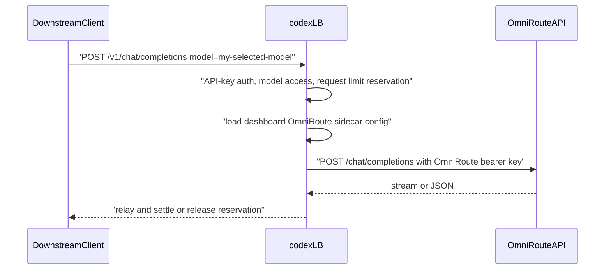

# OmniRoute Sidecar Routing Context

## Purpose and scope

This change lets codex-lb route configured OmniRoute model requests to the OmniRoute OpenAI-compatible API while preserving codex-lb's API-key guard, model allowlist checks, and rate-limit accounting surface.

OmniRoute owns upstream provider routing, billing, cooling, and model catalog semantics. codex-lb only decides whether a request is an OmniRoute sidecar request, forwards it to OmniRoute, and relays the result to the downstream client.

## Architecture decision

OmniRoute is reached at an operator-configured base URL (default `http://127.0.0.1:20128/v1`). Operators configure codex-lb from the dashboard with an OmniRoute API key and an explicit list of selected model IDs. Environment variables can seed first-run defaults, but the dashboard settings row owns runtime sidecar configuration once it exists.

codex-lb dispatches by the effective model name after API-key enforced-model resolution. A model whose normalized name is exactly equal to one of the selected OmniRoute model IDs is an OmniRoute sidecar candidate. Claude sidecar prefix checks run first, OpenRouter sidecar prefix checks run second, and OmniRoute exact-model checks run third. Native Codex routing runs when no sidecar match applies.

The selected-model list is intentionally exact rather than prefix-based so that OmniRoute does not accidentally capture native Codex model IDs such as `gpt-5.4-codex` even when OmniRoute's upstream catalog exposes overlapping names. Operators choose exactly which model IDs they want OmniRoute to handle.

## Runtime flow



## OmniRoute setup example

OmniRoute exposes an OpenAI-compatible API behind a single bearer key managed in the OmniRoute dashboard at `/omni`. codex-lb sends `Authorization: Bearer <omniroute-api-key>` on forwarded requests.

## codex-lb env example

These values are startup defaults. Operators should use dashboard Settings to enable, test, and update the sidecar after codex-lb is running.

```bash
CODEX_LB_OMNIROUTE_SIDECAR_ENABLED=true
CODEX_LB_OMNIROUTE_SIDECAR_BASE_URL=http://127.0.0.1:20128/v1
CODEX_LB_OMNIROUTE_SIDECAR_API_KEY=<omniroute-api-key>
CODEX_LB_OMNIROUTE_SIDECAR_SELECTED_MODELS='["my-selected-model"]'
```

## Exact match warning

OmniRoute routing matches the effective model exactly, not by prefix. Operators MUST add every model ID they want OmniRoute to handle to the selected list. Adding a native Codex model ID such as `gpt-5.4-codex` would intentionally bypass native Codex account selection for that model.

## Dashboard management notes

The dashboard Settings page owns the OmniRoute sidecar enabled flag, base URL, sidecar API key, selected model IDs, and timeouts. Saved API keys are encrypted at rest and are never returned in plaintext. The Settings card surfaces an `Open OmniRoute` link to the existing `/omni` reverse-proxy dashboard.

The Accounts page shows OmniRoute as a synthetic read-only account named `OmniRoute` when sidecar configuration exists or is enabled. This row is an operator surface only; it is not inserted into the real `accounts` table.

Request logs identify OmniRoute sidecar traffic with `source = "omniroute_sidecar"` and no Codex account.

## Failure modes

- OmniRoute unreachable: codex-lb returns a 503 OpenAI error envelope and releases any API-key reservation.
- Invalid OmniRoute API key: OmniRoute returns its own auth error; codex-lb relays an OpenAI-compatible error when available.
- Unknown model: request follows the native Codex path or returns model-not-found from Codex upstream.
- Missing sidecar usage: codex-lb releases the reservation instead of leaving it pending.
