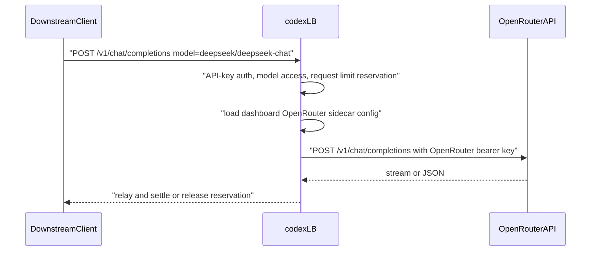

# OpenRouter Sidecar Routing Context

## Purpose and scope

This change lets codex-lb route configured OpenRouter model requests to the direct OpenRouter OpenAI-compatible API while preserving codex-lb's API-key guard, model allowlist checks, and rate-limit accounting surface.

OpenRouter remains the owner of upstream provider routing, billing, and model catalog semantics. codex-lb only decides whether a request is an OpenRouter sidecar request, forwards it to OpenRouter, and relays the result to the downstream client.

## Architecture decision

OpenRouter is reached directly at `https://openrouter.ai/api/v1`. Operators configure codex-lb from the dashboard with an OpenRouter API key and explicit model prefixes. Environment variables can seed first-run defaults, but the dashboard settings row owns runtime sidecar configuration once it exists.

codex-lb dispatches by the effective model name after API-key enforced-model resolution. A model whose lowercased name starts with a configured OpenRouter prefix is an OpenRouter sidecar candidate. Claude sidecar prefix checks run first; native Codex routing runs when no sidecar prefix matches.

Default model prefixes are empty because OpenRouter model IDs such as `openai/gpt-4o` can overlap native Codex model names. Operators MUST configure provider-scoped prefixes such as `deepseek/`, `google/`, `meta-llama/`, or `qwen/`.

## Runtime flow



## OpenRouter setup example

Create an OpenRouter API key at https://openrouter.ai/settings/keys.

Optional request headers OpenRouter recommends:

- `HTTP-Referer`: your site URL
- `X-Title`: your app name

codex-lb sends `Authorization: Bearer <openrouter-api-key>` on forwarded requests.

## codex-lb env example

These values are startup defaults. Operators should use dashboard Settings to enable, test, and update the sidecar after codex-lb is running.

```bash
CODEX_LB_OPENROUTER_SIDECAR_ENABLED=true
CODEX_LB_OPENROUTER_SIDECAR_BASE_URL=https://openrouter.ai/api/v1
CODEX_LB_OPENROUTER_SIDECAR_API_KEY=<openrouter-api-key>
CODEX_LB_OPENROUTER_SIDECAR_MODEL_PREFIXES='["deepseek/","google/"]'
```

## Prefix collision warning

Do not configure broad prefixes such as `gpt-` or `openai/` unless you intentionally want those models to bypass native Codex account selection.

## Dashboard management notes

The dashboard Settings page owns the OpenRouter sidecar enabled flag, base URL, sidecar API key, model prefixes, and timeouts. Saved API keys are encrypted at rest and are never returned in plaintext.

The Accounts page shows OpenRouter as a synthetic read-only account named `OpenRouter` when sidecar configuration exists or is enabled. This row is an operator surface only; it is not inserted into the real `accounts` table.

Request logs identify OpenRouter sidecar traffic with `source = "openrouter_sidecar"` and no Codex account.

Unknown OpenRouter model IDs log `$0.00` request cost until a pricing entry is added to `app/core/usage/pricing.py`. This is acceptable for v1; add entries for models you care about in cost dashboards.

## Failure modes

- OpenRouter unreachable: codex-lb returns a 503 OpenAI error envelope and releases any API-key reservation.
- Invalid OpenRouter API key: OpenRouter returns its own auth error; codex-lb relays an OpenAI-compatible error when available.
- Unknown model prefix: request follows the native Codex path or returns model-not-found from Codex upstream.
- Missing sidecar usage: codex-lb releases the reservation instead of leaving it pending.
